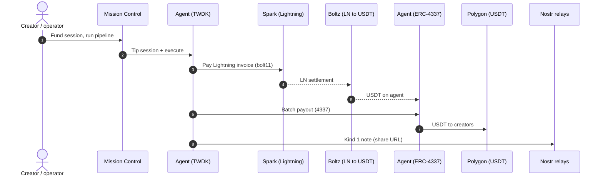
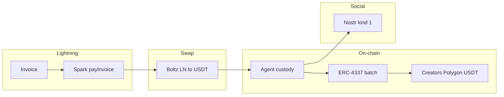

# TipSats ⚡️

**Lightning-native tips for Bitcoin creators <—> USDT , Nostr amplification.**

---

## Problem

Rumble surfaces **on-chain Bitcoin addresses** for support. For **micro-tips**, paying on-chain is often **impractical** (fees and UX swamp small amounts). TipSats is built for **sub-dollar, instant flows**: **Lightning in**, **stablecoin out to creators**, plus **Nostr** to boost creator economy

---

## Technical stack (Tether WDK)
- **Spark wallet** — Lightning integration: `createInvoice`, `payInvoice`, and the path into swaps.
  - **Spark (WDK)** — [`tipsats-backend/src/lib/spark.ts`](https://github.com/Vib-UX/tipsats/blob/main/tipsats-backend/src/lib/spark.ts) · harness quote/pay — [`test-harness-twdk-spark-ln/lightning.ts`](https://github.com/Vib-UX/tipsats/blob/main/test-harness-twdk-spark-ln/lightning.ts)
- **LN ↔ USDT** — Boltz-style atomic swap; recent ecosystem momentum around Lightning and stablecoin rails ([Boltz on X, Mar 18](https://x.com/Boltzhq/status/2034302804286644429)).
  - **Boltz harness** — [`test-harness-twdk-spark-ln/boltz.ts`](https://github.com/Vib-UX/tipsats/blob/main/test-harness-twdk-spark-ln/boltz.ts)
- **TWDK + ERC-4337** — **batch** USDT transfers from the agent wallet to **multiple creator addresses** in one user-operation flow (Polygon).
  - **ERC-4337 + batch API** — [`tipsats-backend/src/lib/evm4337.ts`](https://github.com/Vib-UX/tipsats/blob/main/tipsats-backend/src/lib/evm4337.ts) · [`tipsats-backend/src/routes/agent.ts`](https://github.com/Vib-UX/tipsats/blob/main/tipsats-backend/src/routes/agent.ts)
- **Nostr** — publish after payout to **boost visibility** and engagement around the tipped channels.
  - **Publish + NWC bridge** — [`tipsats-backend/src/lib/nostr-publish.ts`](https://github.com/Vib-UX/tipsats/blob/main/tipsats-backend/src/lib/nostr-publish.ts) · [`tipsats-backend/src/lib/nwc-config.ts`](https://github.com/Vib-UX/tipsats/blob/main/tipsats-backend/src/lib/nwc-config.ts)
- **Pipeline** (pay bolt11 → wait for USDT → ERC-4337 batch → Nostr) — [`tipsats-backend/src/lib/pipeline.ts`](https://github.com/Vib-UX/tipsats/blob/main/tipsats-backend/src/lib/pipeline.ts)
- **Dependencies** (`@tetherto/wdk-wallet-spark`, `@tetherto/wdk-wallet-evm-erc-4337`, `nostr-tools`, …) — [`tipsats-backend/package.json`](https://github.com/Vib-UX/tipsats/blob/main/tipsats-backend/package.json)

---

## Architecture (high level)

---

## Transaction details & Outputs

- **TWDK Spark invoice settlement** — Lightning payment settles in Spark when the pipeline pays the Boltz-issued bolt11 ([`payInvoice` flow](https://github.com/Vib-UX/tipsats/blob/main/tipsats-backend/src/lib/spark.ts)).

  
  

- **TWDK ERC-4337 batch distribution to creators** — [Polygon transaction (Blockscout)](https://polygon.blockscout.com/tx/0xaf972c24b2fa32d8dfbd91a59ad168712d4deb1fbc517b6ec07a76ee21222f5a)

  

- **Nostr event** — [Notes on Nostur Client](https://jumble.social/notes/nevent1qvzqqqqqqypzq8mprkeja9c9k38sw95jk604q79tdqrnxttg8uuspyp9k04unaywqy88wumn8ghj7mn0wvhxcmmv9uq32amnwvaz7tmjv4kxz7fwv3sk6atn9e5k7tcqyp2gmkl49eyqxx64ka89eysvrla42qvtev765dqkwz308exa8gye7c26wes)

  

---

_Lightning + USDT + Nostr — TipSats._
